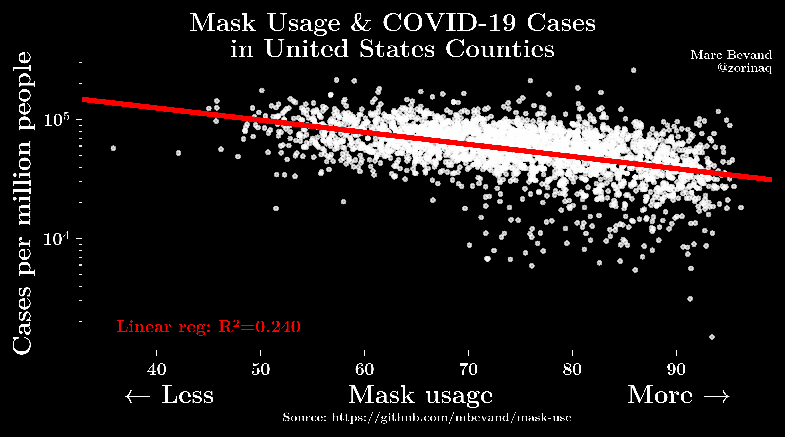

# Comparing mask use to COVID-19 case numbers

Ask 250,000 people: "*How often do you wear a mask in public when you expect to be within six feet of another person?*" and their answers correlate with COVID-19 case numbers across 3,000+ United States counties. On average, low mask usage counties (score=60) reported about twice as many cases per capita as high mask usage counties (score=90):

## Interpretation

Among the 3,114 US counties that could be matched between the mask usage survey data and the JHU CSSE dataset, masking scores range from about 35 to about 95.

We find a moderate correlation between masking score and case numbers (R² = 0.240). A low mask usage score of 60 is associated to reporting twice as many cases per capita than a high mask usage score of 90.

Note that this analysis does not control for other variables and is subject to confounding biases, for example people who report more frequent mask usage probably adhere to stronger social distancing protocols.

## Methodology

### Survey

The global data and survey firm Dynata, at the request of The New York Times, conducted a large number of interviews in the United States to obtain 250,000 survey responses about mask use, enough data to provide estimates more detailed than the state level: https://github.com/nytimes/covid-19-data/tree/master/mask-use

The firm asked the question "*How often do you wear a mask in public when you expect to be within six feet of another person?*" Respondents could give one of five possible answers: never, rarely, sometimes, frequently, always. The survey was conducted between 2020-07-02 and 2020-07-14.

Raw survey responses were then transformed into county-level estimates: the survey data was weighted by age and gender, and survey respondents’ locations were approximated from their ZIP codes. Then estimates of mask-wearing were made for each census tract by taking a weighted average of the 200 nearest responses, with closer responses getting more weight in the average. These tract-level estimates were then rolled up to the county level according to each tract’s total population.

### Masking score

From this survey data, we synthesize a *masking score* for each US county, based on the fraction of respondents who gave each answer:

  masking score = 0 × NEVER + 25 × RARELY + 50 × SOMETIMES + 75 × FREQUENTLY + 100 × ALWAYS

This produces a score between 0 and 100 indicating respectively that residents of the county never masks, or always wear masks.

### COVID-19 case numbers

For each county, we also obtained the cumulative number of COVID-19 cases recorded during the 6-month period following the survey (2020-07-01 to 2020-12-31). We use [JHU CSSE](https://github.com/CSSEGISandData/COVID-19) as the data source.

The number of cases per capita is calculated based on population data also from JHU CSSE ([time_series_covid19_deaths_US.csv, column Population](https://github.com/CSSEGISandData/COVID-19/blob/master/csse_covid_19_data/csse_covid_19_time_series/time_series_covid19_deaths_US.csv))

### Linear regression

We plot each US county on a scatterplot: their masking score are on the X axis, and cases per capita on the Y axis (log scale). Then Y values are log-transformed before calculating a linear regression.
